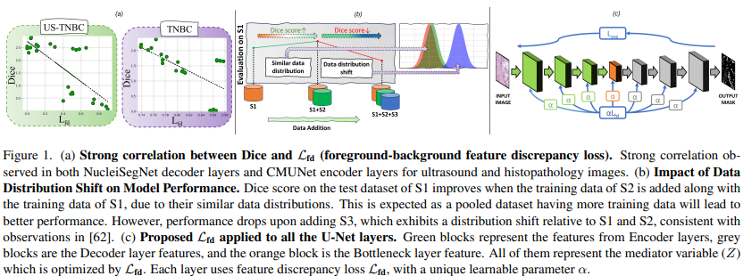
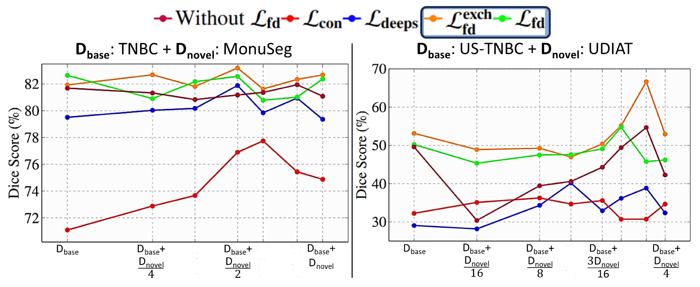

# [arXiv] Is Exchangeability better than I.I.D to handle Data Distribution Shifts while Pooling Data for Data-scarce Medical image segmentation?

<p align="center">
  <strong>Ayush Roy</strong>¹ &middot; 
  <strong>Samin Enam</strong>¹ &middot;  
  <strong>Jun Xia</strong>¹ &middot; 
  <strong>Won Hwa Kim</strong>² &middot; 
  <strong>Vishnu Suresh Lokhande</strong>¹
</p>

<p align="center">
  ¹ University at Buffalo, SUNY &bull; ² POSTECH
</p>

## Abstract

Data scarcity is a major challenge in medical imaging, particularly for deep learning models. While data pooling (combining datasets from multiple sources) and data addition (adding more data from a new dataset) have been shown to enhance model performance, they are not without complications. Specifically, increasing the size of the training dataset through pooling or addition can induce distributional shifts, negatively affecting downstream model performance, a phenomenon known as the “Data Addition Dilemma”. While the traditional i.i.d. assumption may not hold in multi-source contexts, assuming exchangeability across datasets provides a more practical framework for data pooling. In this work, we investigate medical image segmentation under these conditions, drawing insights from causal frameworks to propose a method for controlling foreground-background feature discrepancies across all layers of deep networks. This approach improves feature representations, which are crucial in data-addition scenarios. Our method achieves state-of-the-art segmentation performance on histopathology and ultrasound images across five datasets, including a novel ultrasound dataset that we have curated and contributed. Qualitative results demonstrate more refined and accurate segmentation maps compared to prominent baselines across three model architectures. The code will be available on Github.

## Installation
Clone the repository and run the following commands.

```bash
conda create --name exchg python=3.10
conda activate exchg
pip install -r requirements.txt
```

## Datasets
You can follow the official websites of TNBC (Histopathology), MonuSeg (Histopathology), UDIAT (Ultrasound) for downloading.

The preprocessed datasets used in this project can be found in the following links:-

TNBC  and MonuSeg: https://www.kaggle.com/datasets/ayush02102001/tnbc-seg

UDIAT: https://www.kaggle.com/datasets/ayush02102001/udiat-segmentation-dataset

US-TNBC dataset will be provided on request to aroy25@buffalo.edu.

## Qualitative Results
Below we see the outputs of th UNets with and without the use of feature disentanglement loss.


We also provide Heatmaps of the last encoder layer, last decoder layer, and the bottleneck layer of the UNets with and without the use of feature disentanglemen loss in the figure below.

<p align="center">
  
</p>

## Data Addition Dilemma
The data addition can be achieved by modifying a subset of the data loader with this (k is the number of samples you want for the paritcular iteration of data addition):
```
size = 512   # image size: 512x512
root_path = '/kaggle/input/tnbc-seg/MonuSeg/MonuSeg/Training'
X_train_dil, y_train_dil = load_data_training(root_path, size)
y_train_dil = np.expand_dims(y_train_dil, -1)
X_train_dil = X_train_dil[:k]
y_train_dil = y_train_dil[:k]

X_train = np.concatenate((X_train, X_train_dil))
y_train = np.concatenate((y_train, y_train_dil))
print("####DATA DILEMMA####")
print("X:", X_train.shape)
print("y:", y_train.shape)
```

To implement the exchangeable feature disentanglement loss, replace the feature disentanglement loss with this (the code below is an example for the loss between the 2nd decoder and encoder layers and can be exactly used to replace the loss between the other layers):
```
def de_2_loss_enc(y_true, y_pred):
    y_true = Pool()(y_true)
    fg, bg = extract_features(y_true, y_pred)
    loss_dir = ReduceMeanLoss(-1,False)(-tf.math.log(tf.norm(fg - bg, axis=0)))
    fg_shu = tf.random.shuffle(fg) #### This is the part introducing exchangeability among the foregroudn and background features
    bg_shu = tf.random.shuffle(bg) #### This is the part introducing exchangeability among the foregroudn and background features
    loss_shu = ReduceMeanLoss(-1,False)(-tf.math.log(tf.norm(fg_shu - bg_shu, axis=0)))
    loss = weight_1_enc*(loss_dir + loss_shu)
    return loss
```

We provide the sequential Datat Addition plot in the figure below.

<p align="center">
  
</p>

# Citation
```bibtex
@article{roy2025exchangeability,
  title={Is Exchangeability better than IID to handle Data Distribution Shifts while Pooling Data for Data-scarce Medical image segmentation?},
  author={Roy, Ayush and Enam, Samin and Xia, Jun and Lokhande, Vishnu Suresh and Kim, Won Hwa},
  journal={arXiv preprint arXiv:2507.19575},
  year={2025}
}
```
